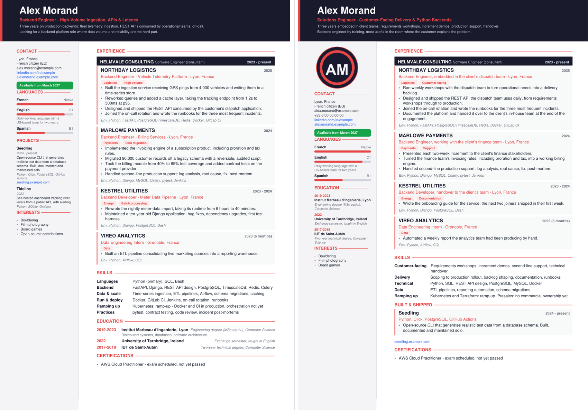

# cv-tailor

A CV rewritten for each job offer, with an AI assistant, under rules that stop
it from lying.

Generating a good-looking PDF from structured data is a solved problem -
[RenderCV](https://github.com/rendercv/rendercv) and
[JSON Resume](https://jsonresume.org/) do it well. The hard part is everything
around it: deciding what this particular employer needs to read, dropping what
they do not care about, and staying honest while you do it, at eleven at night,
on your fifth application of the week.

That is what this repository is: a way of working with an assistant, plus the
checks that keep it straight.



*One profile, two offers. Left: a backend platform role - ingestion, latency,
on-call. Right: a customer-facing solutions role - workshops, demos, support,
handover. Nothing was invented between the two; the emphasis moved. (Alex
Morand and both companies are fictional.)*

## Facts and framing are different files

```
profile/profile.yaml                     what is TRUE     - written once
applications/<company>/target.yaml       how it is FRAMED - one per offer
```

The profile holds employers, contract titles, dates, schools and bullet-level
facts, each with an id. An overlay picks facts, orders them, and may reword
them - always through the id:

```yaml
bullets:
  - from: nb-workshops                     # profile wording, kept as is
  - from: nb-api                           # same fact, aimed at this reader
    text: "Designed and shipped the REST API the dispatch team uses daily,
            from requirements workshops through to production."
```

A line with no `from:` is refused. An overlay that tries to change an employer,
a contract title or a date is refused. That is the whole trick: the assistant
can argue about emphasis, it cannot quietly promote you.

## The loop

1. Drop the offer in `applications/<company>/offer.md`.
2. Ask the assistant to read it and give a verdict first: what fits, what is
   transferable, what is missing, whether to apply at all. That verdict is kept
   in the overlay under `meta.fit`.
3. Build the overlay together: which experiences, which order, which bullets,
   which skill rows, which headline.
4. `python build.py <company>` - PDF out, checks run.
5. Fix what the checks report. Then write the letter.

The rules the assistant follows live in [CLAUDE.md](CLAUDE.md) (and
[AGENTS.md](AGENTS.md) for other tools). They are the useful part of this repo,
more than the code.

## What the build checks

```
$ python build.py orbital-freight

Orbital Freight - Backend Platform Engineer
  output:  applications/orbital-freight/CV_Alex_Morand_Orbital_Freight.pdf
  [INFO] margins: page 'en': bottom white space left 120.4mm / right 27.1mm (target 15-45mm)
  [INFO] pages: 1 page(s), as declared
  [INFO] sources: 11 bullet(s) rendered, 0 reworded for this offer, 11 traced back to profile.yaml
```

| Check | Fails when |
| --- | --- |
| `sources` | a CV line does not point back to a fact in the profile |
| `gaps` | a skill you listed as *not* mastered is written as if owned |
| `figures` | a reworded line grew a number its source fact did not have |
| `charset` | a character the PDF base fonts cannot draw (the usual square box) |
| `pages` | content overflowed the declared number of pages |
| `margins` | no white space left at the bottom - or far too much |

The `gaps` check is the one worth explaining. You write down once, in your
profile, what you do not master:

```yaml
gaps:
  - term: Kubernetes
    hedge: "ramp-up"
```

After that, `Kubernetes` may appear on a CV only next to a marker - *ramp-up*,
*transferable*, *basics*, *open to*, *academic*. Otherwise the build fails.
`forbidden: true` goes further: the term is refused even when marked, for the
skill you have never touched and for the wording you must never use ("AWS Certified"
while the exam is not passed).

Tailoring a CV is legitimate; this is where it stops being tailoring.

## Quickstart

```bash
git clone https://github.com/fazonyx/cv-tailor && cd cv-tailor
pip install -r requirements.txt
python build.py            # builds the two fictional example applications
```

Then make it yours:

1. Put your current CV, your competency file and, if you want one, a photo in
   `sources/`. That folder is git-ignored.
2. Ask your assistant to read them and write `profile/profile.yaml`, using
   `profile/profile.example.yaml` as the reference (see
   [profile/schema.md](profile/schema.md)). Correct it until every line is true
   - everything downstream depends on this file.
3. Copy an example application folder, drop in a real offer, and start the loop.

Requires Python 3.9+ and ReportLab. Fonts are the PDF base fonts, so there is
nothing to install and nothing to license.

## What you get

- Two-column A4 layout, block heights computed from content rather than
  hard-coded, so nothing silently overflows.
- Employer bands for consultants: one contract, several client missions, the
  contract title locked and the mission framing free.
- Bilingual CVs: one PDF, one page per language, each page checked separately.
  The second example is English plus French - and the French page is where the
  one-page rule bites, because French runs longer
  ([see it](docs/images/preview-solutions-fr.png)).
- Sections are data. Moving education to the sidebar to make room for a
  project is one line in the overlay.
- A cover letter converter (`tools/md_to_pdf.py`) matching the CV's palette,
  and a general Markdown-to-PDF converter for interview notes
  (`tools/md_to_pdf_rich.py`).
- Tests on the guardrails themselves (`python -m pytest tests -q`): a bullet
  with no source, an overlay promoting you to "Senior Staff Engineer", a gap
  written as an owned skill - each one has a test proving it is refused.
- A GitHub Actions workflow that runs those tests and rebuilds the examples on
  every push, so the one-page rule is enforced by CI and not by memory.

## Your data stays yours

`sources/`, `profile/profile.yaml` and generated PDFs are git-ignored. A
`hooks/pre-commit` is included that refuses a commit containing anything from
`sources/`; install it with:

```bash
git config core.hooksPath hooks
```

If you fork this repository to keep your own applications in it, make the fork
**private**. A CV is a pile of personal data, and a competency file often
contains client names you are not free to publish.

## License

MIT - see [LICENSE](LICENSE). Everything in `profile/profile.example.yaml` and
`applications/` is invented: the person, the employers, the schools, the
projects and the companies hiring.
